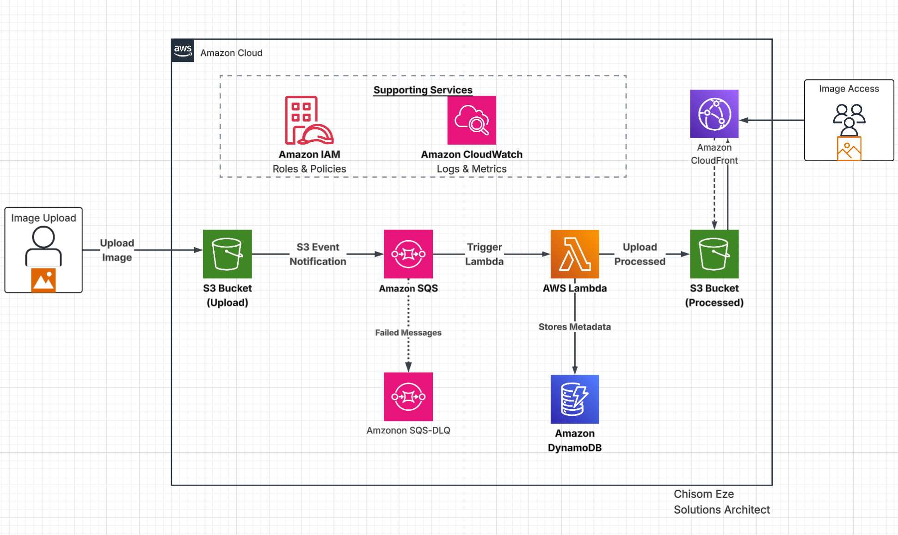
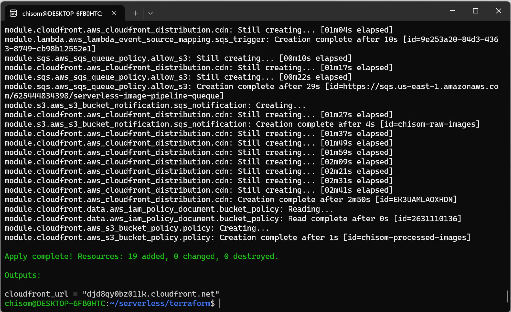
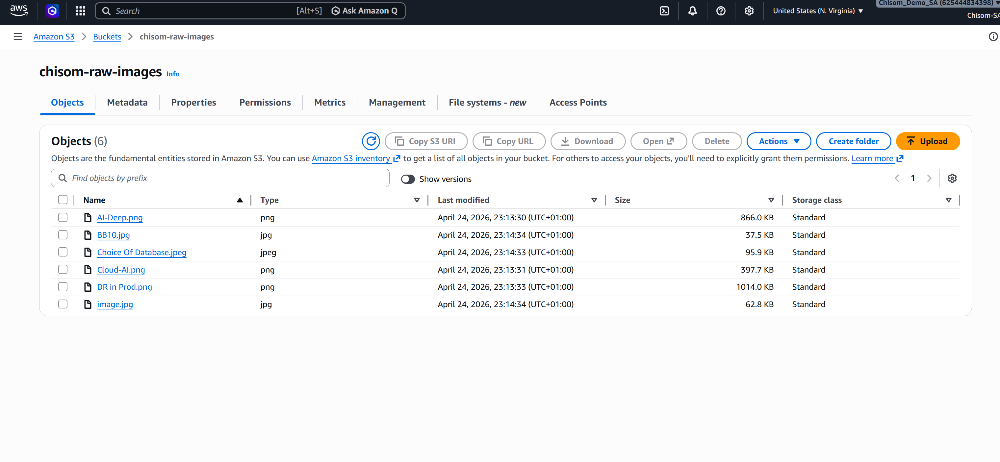
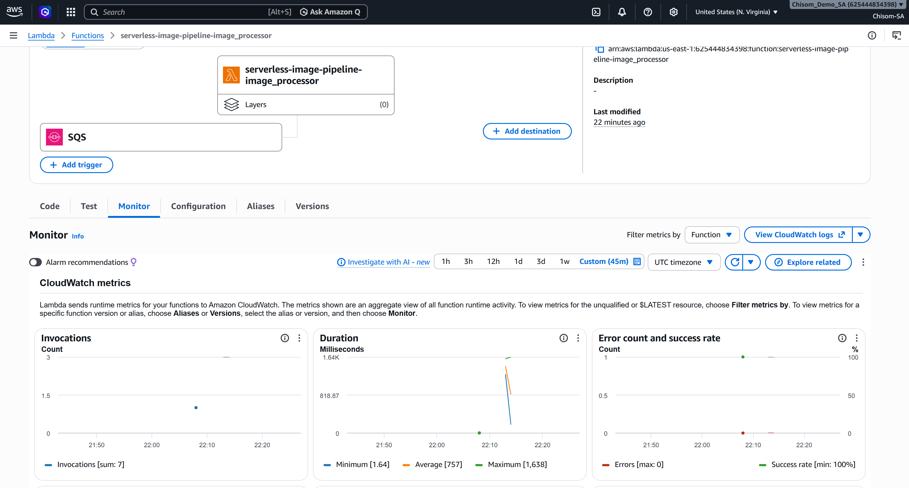
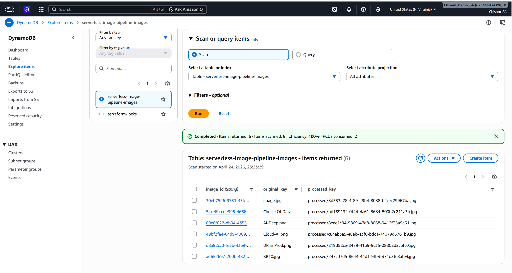
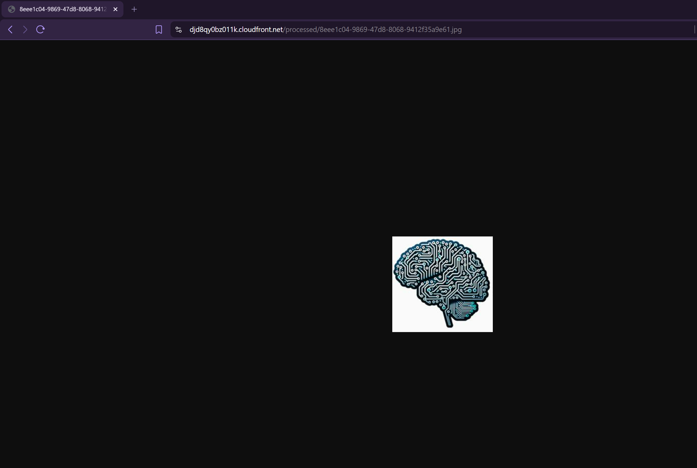
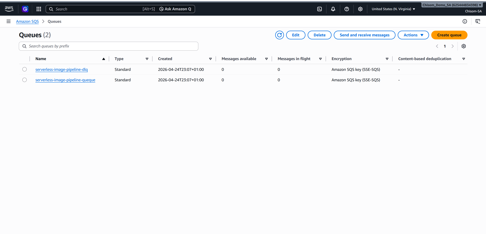
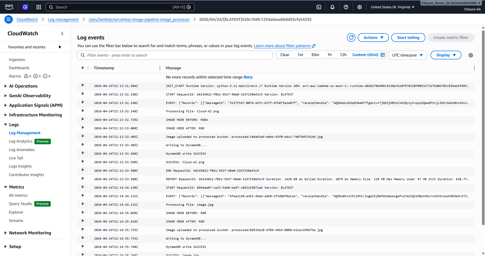

# AWS Serverless Image Processing Pipeline

A production-grade serverless image processing pipeline built on AWS using Terraform.

This project demonstrates a real-world event-driven architecture where users upload images to Amazon S3, triggering asynchronous image processing with AWS Lambda through Amazon SQS. Processed images are stored securely and delivered globally through Amazon CloudFront, while metadata is persisted in Amazon DynamoDB.

---

## Features

- Upload images to Amazon S3
- Event-driven image processing with Amazon SQS + AWS Lambda
- Image conversion and resizing using Pillow
- Metadata storage in Amazon DynamoDB
- Secure image delivery through Amazon CloudFront
- Infrastructure as Code with Terraform
- Dockerized Lambda packaging for dependency consistency
- Dead Letter Queue (DLQ) handling for failed events
- Private S3 bucket access through CloudFront Origin Access Control (OAC)

---

## Architecture



### Workflow

1. User uploads image to the raw S3 bucket  
2. S3 sends event notification to SQS  
3. SQS triggers Lambda  
4. Lambda downloads image from raw bucket  
5. Lambda processes and resizes image  
6. Lambda uploads processed image to processed bucket  
7. Lambda stores metadata in DynamoDB  
8. CloudFront securely serves processed images  

---

## AWS Services Used

- Amazon S3
- Amazon SQS
- AWS Lambda
- Amazon DynamoDB
- Amazon CloudFront
- AWS IAM
- Amazon CloudWatch

---

## Tech Stack

- Python
- Terraform
- Docker
- Pillow (Python Imaging Library)

---

## Project Structure

```bash
terraform/
├── main.tf
├── variables.tf
├── outputs.tf
└── modules/
    ├── s3/
    ├── sqs/
    ├── lambda/
    ├── dynamodb/
    ├── iam/
    └── cloudfront/
```

## Challenges Solved

This project involved solving several real-world engineering problems:

- Lambda packaging issues on Windows/WSL
- Installing and packaging Pillow dependencies with Docker
- Handling RGBA → JPEG conversion errors
- Decoding URL-encoded S3 object keys
- IAM permission and AccessDenied troubleshooting
- SQS retries and duplicate processing issues
- DLQ handling for failed messages
- CloudFront Origin Access Control (OAC) configuration
- Private S3 bucket access restrictions
- Terraform state and deployment troubleshooting

---

## Screenshots

### Complete Terraform Deployment

<p align="center">
  
</p>

### Raw Images S3 Bucket

<p align="center">
  
</p>

### Lambda Invocation Counts

<p align="center">
  
</p>

### DynamoDB Metadata Records

<p align="center">
  
</p>

### CloudFront Processed Image Delivery

<p align="center">
  
</p>

### SQS and DLQ

<p align="center">
  
</p>

## Lambda Succesful Processing Logs

<p align="center">
  
</p>

---

## Example CloudFront URL

```text
https://<cloudfront-url>/processed/<image-id>.jpg
```

## Security Best Practices Implemented

- Private processed S3 bucket
- CloudFront OAC for restricted access
- IAM least privilege permissions
- `.gitignore` to prevent accidental secret leakage
- `.dockerignore` for optimized Docker builds

---

## Future Improvements

- CI/CD pipeline with GitHub Actions
- Signed URLs for private image access
- API Gateway integration
- Multiple responsive image sizes (thumbnail / medium / large)
- Monitoring and alerts with CloudWatch Alarms
- Custom domain with SSL certificate

---

## Author

**Chisom Eze**  
Solutions Architect  

☁️ Passionate about building scalable cloud-native systems  

---

⭐ If you found this project interesting, feel free to star the repository.
